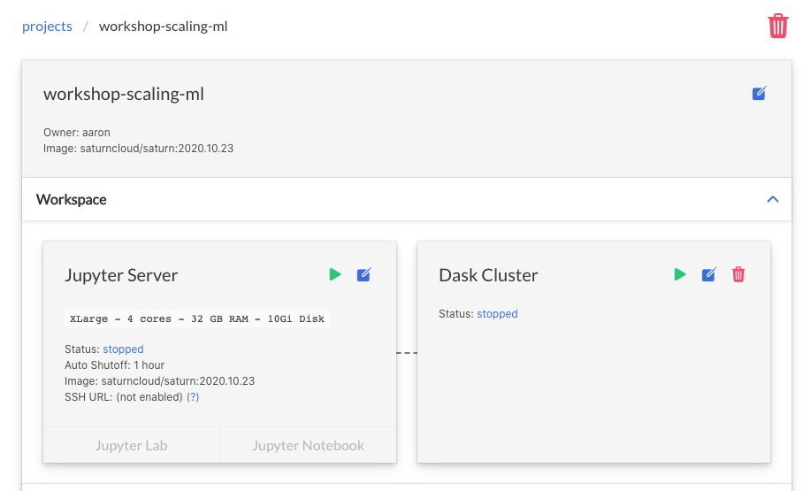
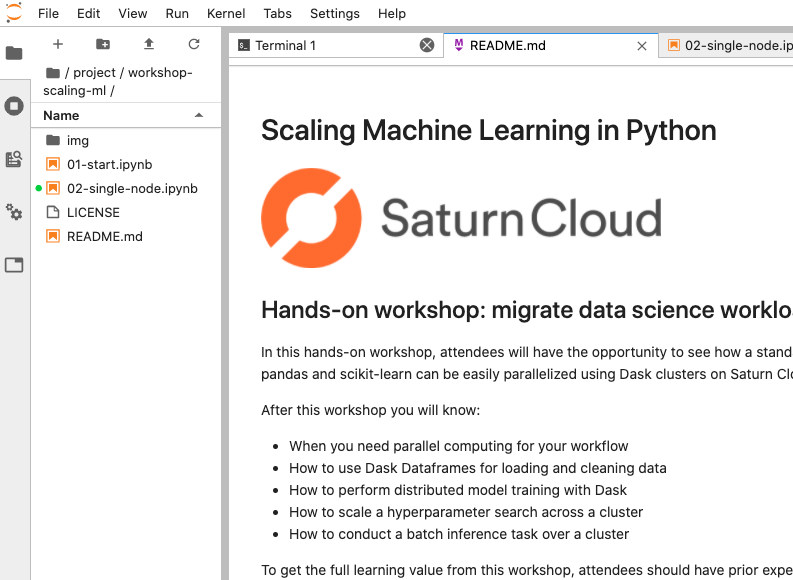

# Machine Learning on Big Data with Dask

## Hands-on workshop: data processing and model training at scale

In this hands-on workshop, you will be introduced to Dask, a Python-native parallel computing framework. Dask extends traditional Python tools to operate at scale across a cluster of machines, removing memory and compute limitations. The tutorial covers setting up a Dask cluster in Saturn Cloud, processing large datasets efficiently, and performing machine learning model training across the cluster.

After this workshop you will know:
- What Dask is and how it fits in with the broader PyData ecosystem
- When to use Dask to scale out machine learning workloads
- How to use Dask Dataframes for loading and cleaning data
- How to perform distributed model training with Dask

To get the full learning value from this workshop, attendees should have prior experience with machine learning in Python. Experience with parallel computing is not needed.


## Getting started

### Steps

1. Create an account on [Saturn Cloud Hosted](https://accounts.community.saturnenterprise.io/register) or use your organization's existing Saturn Cloud Enterprise installation. 
1. Create a new project (keep defaults unless specified here)
    - Name: "workshop-dask-ml-big-data"
    - Image: `saturncloud/saturn:2020.11.30` <br> (or latest available `saturncloud/saturn:*` image)
    - Workspace Settings
        - Size: `XLarge - 4 cores - 32GB RAM`
    - Click "Create"
1. Attach a Dask Cluster to the project
    - Worker Size: `XLarge - 4 cores - 32GB RAM`
    - Number of workers (n_workers): 5
    - Number of worker threads (nthreads): 4
    - Click "Create"
1. Start both the Jupyter Server and Dask Cluster
1. Open Jupyter Lab
1. From Jupyter Lab, open a new Terminal window and clone the workshop-scaling-ml repository:
    ```bash
    git clone https://github.com/saturncloud/workshop-dask-ml-big-data.git /tmp/workshop-dask-ml-big-data
    cp -r /tmp/workshop-dask-ml-big-data /home/jovyan/project
    ```
1. Navigate to the "workshop-dask-ml-big-data" folder in the File browser and start from the [01-start.ipynb](01-start.ipynb) notebook.


### Screenshots

The project from the Saturn UI should look something like this:



JupyterLab should look like this:


